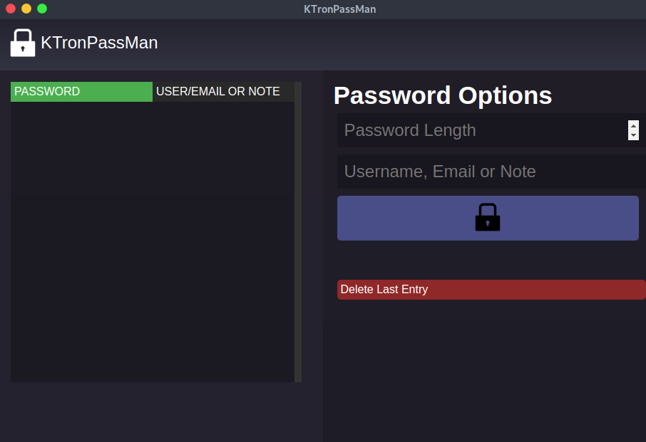

### KTronPassMan
- check the web version https://thegbo.github.io/KTronPassMan/build/
-a simple electron.js password manager using localstorage, i made this to learn react.js and electron.js
#### This app does NOT store passwords in any kind of database, this app uses Browser's localStorage instead

